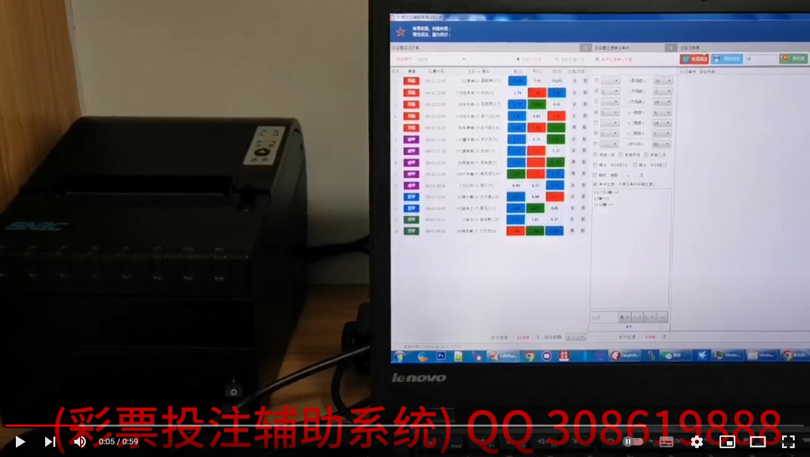
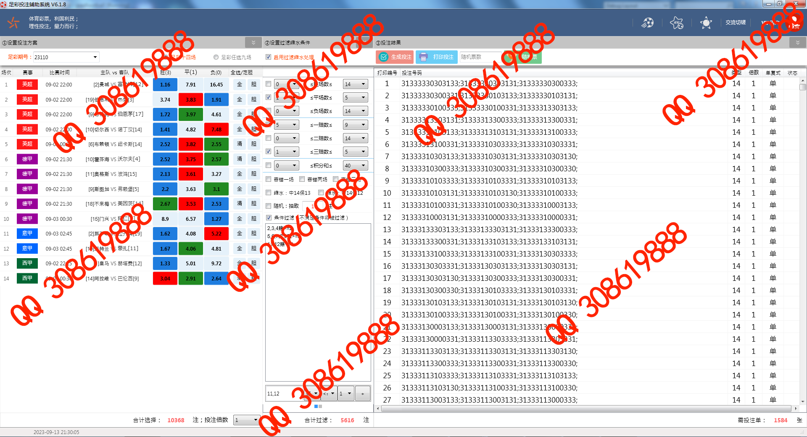
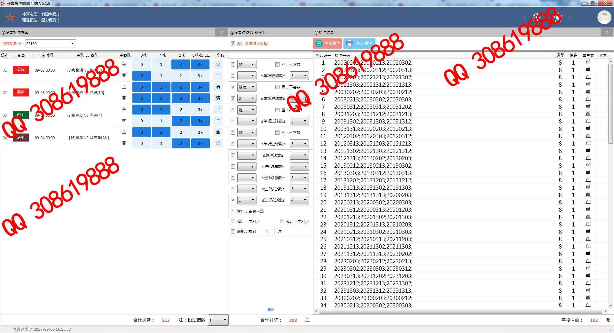
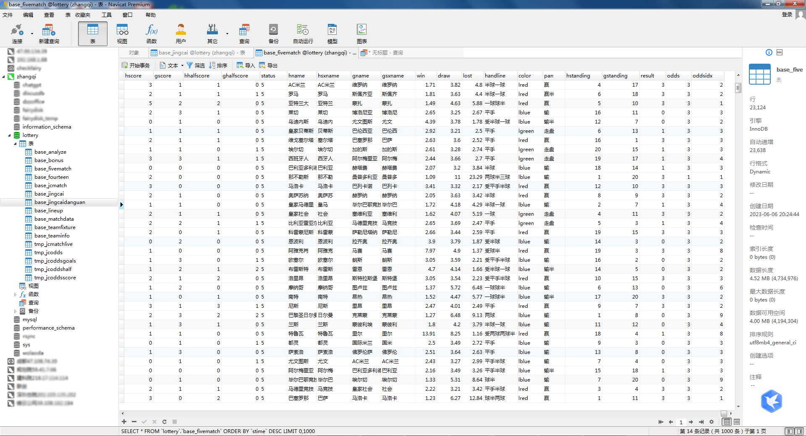

# 彩票投注辅助系统

**写在最前：**

二十多年前一次偶然的机会，应邀开发足彩缩水软件，当时还是十三场（设有一二三等奖），结果软件写出来的时候，足彩从十三场改成了十四场，从此业余时间就一直修修改改，写写停停。从数学统计分析的角度来看，同样的资金在足彩缩水软件的帮助下肯定可以大幅提高中奖率，但足球是圆的，赛事结果的走向，不单是球队实力直接对抗的结果，还涉及到各种外在因素及利益的影响，所以强大的软件功能很重要，个人对比赛的阅读也同样重要。

**彩票过滤：**

双色球代码，稍加修改即支持大乐透， 彩票软件可以提升你的参与感，提升中奖命中率，但它不是万能的中奖钥匙。

**重点概述：**

1.支持足彩十四场、任选九场、进球彩、半全场投注分析出票

2.支持胆拖模式下十四场和任九场的单、复试过滤和注水

2.除常规过滤功能外，还支持按赔率自定义条件的自由组合过滤

3.可外接热敏打印机打印投注结果

4.附带十几年百万级比赛数据文件(请君自行分析)，SQL文件需打赏些茶点

总之软件功能超级强大，在网络购彩被关的情况下，过滤后的成百上千注方案通过手填是不可能的，软件出单，拿到彩票店刷票即可(热敏纸找彩票老板要)

# 实操视频

送人玫瑰，手有余香，欢迎您扫码打赏.

# 交友切磋请加微

# 附软件截图一二

